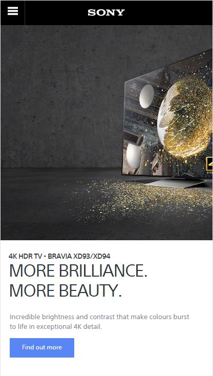
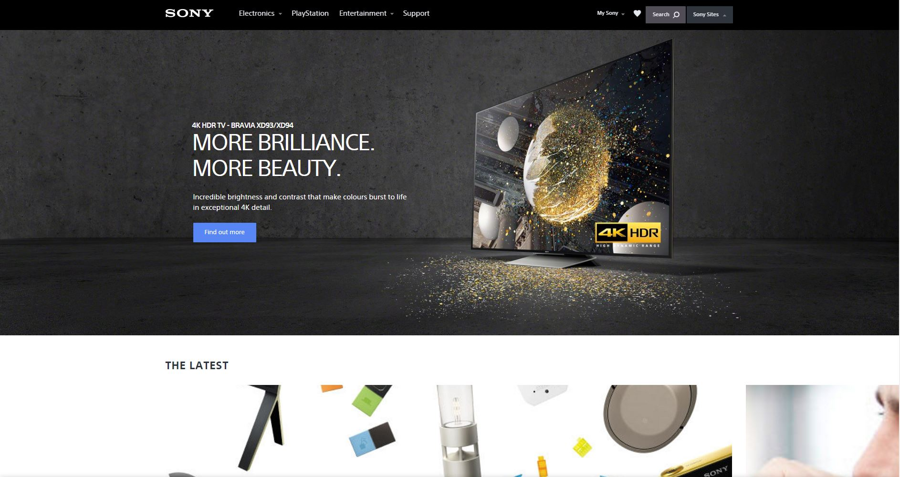

# A comparison between responsive designs

This is a comparison of a easyjet website **this is a sting comment**

[Easy Jet website](http://www.easyjet.com/en)>> I am a note

```html

<html>

<h1> This is bad </h1>

```
## This is how we include and image 

>> <sub> this is from the desktop </sub>

```

``` 
## Responsive web sites 

>> <sub> This is the mobile responsive version of the Easy jet web site </sub>

```
```
## Responsive web sites 

>> <sub> This is the web version of the Easy jet web site </sub>

```
```
## Responsive web sites 

>> <sub> This is the mobile version of the Sony web site </sub>

```
```
## Responsive web sites 

>> <sub> This is the web version of the Sony web site </sub>

```
```
## Responsive web sites 

>> <sub> This is the mobile version of the Solent online learning site </sub>

```
```
## Responsive web sites 

>> <sub> This is the web version of the Solent online learning web site </sub>

```
